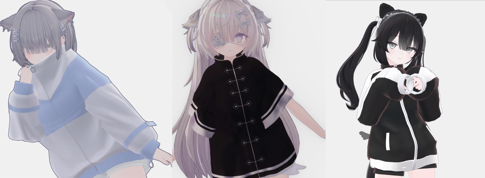
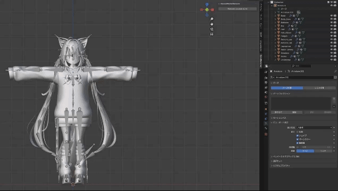

# 概要
私、大家東磨の、3DCGとプログラムそれぞれの制作実績/ポートフォリオに関するリンクと説明です。  

# 3DCG
## 1. VRChatのアバター用衣装制作

メタバース用の服の3Dモデルを制作・販売しました。  
blender, Unity, Substance Painter, CLIP STUDIOを用いて制作しております。  

VRChatというVRメタバースで、既存のいくつかのアバターに着用することを想定しております。  
想定アバターの場合、Unity上でボタン1つで着用できるようになっております。  

詳細な作品紹介は、以下のリンクよりご確認ください。  
URL：https://drive.google.com/file/d/1PvcltmsdTsZ4jgreywAVsJfourBGoYA9/view?usp=sharing  

[BOOTH](https://slumberhalo.booth.pm/)で販売し、合計350着/35万円ほどの売上をあげております。  

# Program
## 1. 「色彩の魔法旅人 ～消えゆくカフェテラスを救え～」

私が研究室のメンバーと制作した、VR/ARを用いたインタラクティブ作品です。  
絵画の中の世界に入り込み、その中の物体を触る体験が実現できたら、それはとても面白いものになるのではないか、というコンセプトで制作しております。  

企画書での審査が通り、[IVRC](https://ivrc.net/2024/seed-stage/)というVR学会の中で行われるコンテストにて展示いたしました。  

体験の概要としては、
- 色の抜け落ちた絵画がARにて表示される
- その絵画に触れると、触れた絵画の中に入れるようになる
- 手を筆のように動かすことで、絵画の色の抜け落ちた部分を着色できる
- 絵画の中の一部の物体に実際に触れることができる
といった形になっています。

私の担当箇所は主に
- テクニカルアーティスト的業務
  - 一部3Dモデルの制作
  - 利用モデルがUnityでも表現できるようなシェーダーの制作
  - 利用モデルのUnityへの最適化）
- vive trackerをUnityで利用するスクリプトの制作
- 色塗り機能の実装

です。

私の担当部分および企画書の詳細は、以下のリンクからご確認ください。  
- シェーダー制作  
  (https://github.com/kusumi-bell/VertexColorShader
  

- [色塗り機能のスクリプト](https://github.com/Toma-Oya/VRVertexPaintTool)
- [企画書](https://drive.google.com/file/d/1Qru-UomTy6KaUvn0YxK4uPeqoPtsH-8S/view?usp=sharing)

## 2. [UnusedBoneRemover](https://github.com/Toma-Oya/UnusedBoneRemover)

私が制作したblenderのアドオンです。  
上記の衣装作成の際に手間だった、アバターの不必要なボーンの削除を効率化するために制作いたしました。  

詳細は以下のリンクに載せております。  
URL：https://github.com/Toma-Oya/UnusedBoneRemover

## 3. [CheckerBoardCalibration](https://github.com/kusumi-bell/CheckerBoardCalibration)

私が卒業研究のために、C#とOpenCVを用いて制作した、チェッカーボードとカメラの位置・角度の関係を取得するプログラムのgitへのリンクです。 

詳細は以下のリンクに載せております。  
URL：https://github.com/kusumi-bell/CheckerBoardCalibration

## 4. [ピッチシフター　概要](https://drive.google.com/file/d/1DNoPefglK8fRiD7CkRASsNSXG99mUCeh/view?usp=sharing)

私がハードウェア・ソフトウェアともに制作したピッチシフターの概要を説明するpdfです。  
PICマイコンにC言語で制作したソフトウェアを焼きこんで制作しております。

電子通信作品デザインコンテストという電子工作のコンテストに提出し、敢闘賞/賞金1万円を受賞しました。

URL：https://drive.google.com/file/d/1DNoPefglK8fRiD7CkRASsNSXG99mUCeh/view?usp=sharing
